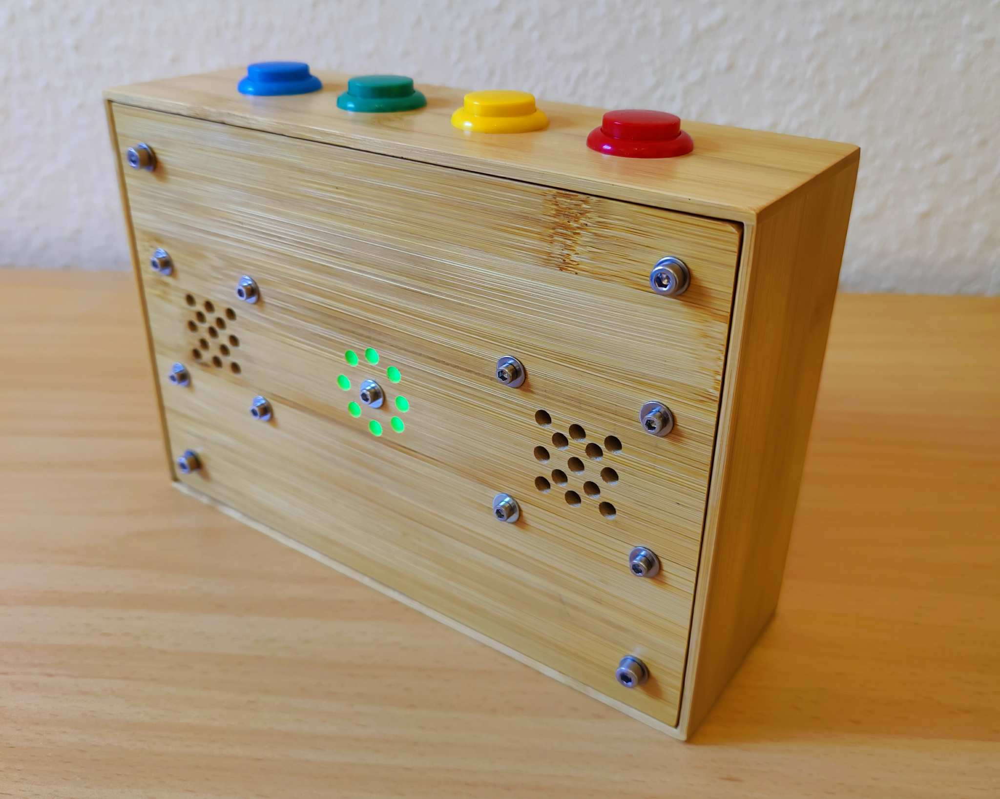
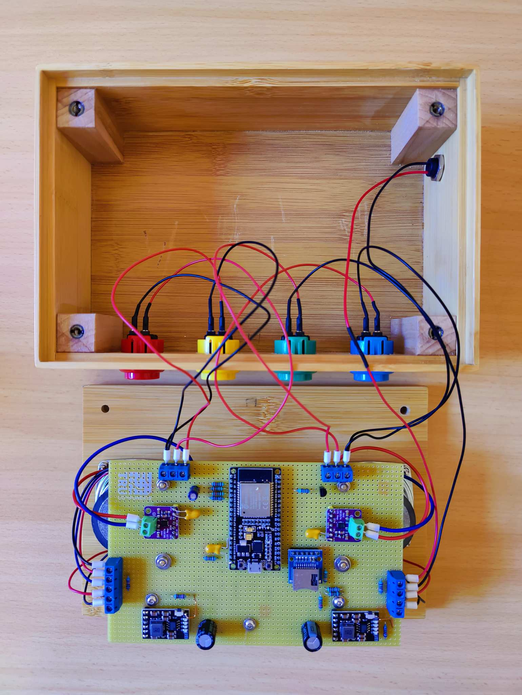
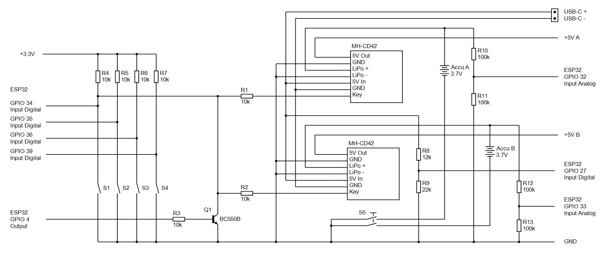
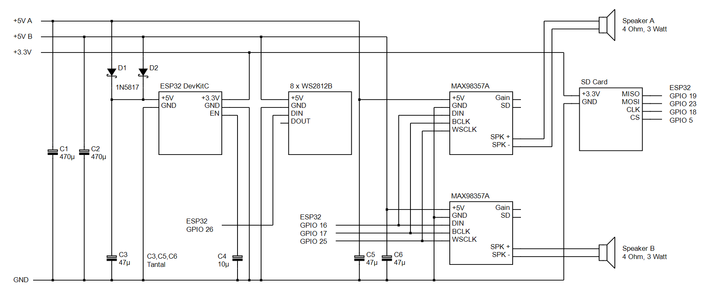
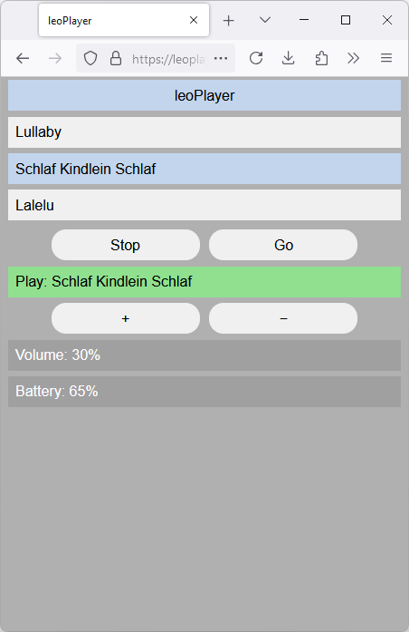

# leoPlayer
ESP32 based children's music box
#### Features
* streams MP3 tracks from a web Server
* battery management for 2 batteries
* cloud based Web UI
* local Web Server for WLAN configuration
#### GPIO Buttons
* GPIO 34 - red Button (On, Next Track, double Click Off)
* GPIO 35 - yellow Button (Stop, Previous Track)
* GPIO 36 - green Button (Volume +, Start)
* GPIO 39 - blue Button (Volume -, Check Battery)
#### GPIO Sensors
* GPIO 27 - USB-C charging detect
* GPIO 32 - Voltage Battery A
* GPIO 33 - Voltage Battery B
#### GPIO MAX98357A I2S
* GPIO 16 - DIN
* GPIO 17 - BCLK
* GPIO 25 - WSCLK
#### GPIO WS2812B LED ring
* GPIO 26 - DIN
#### GPIO SD Card (for future use)
* GPIO 19 - MISO
* GPIO 23 - MOSI
* GPIO 18 - CLK
* GPIO 5 - CS
#### Development Hardware

#### Schematic

#### Web UI
